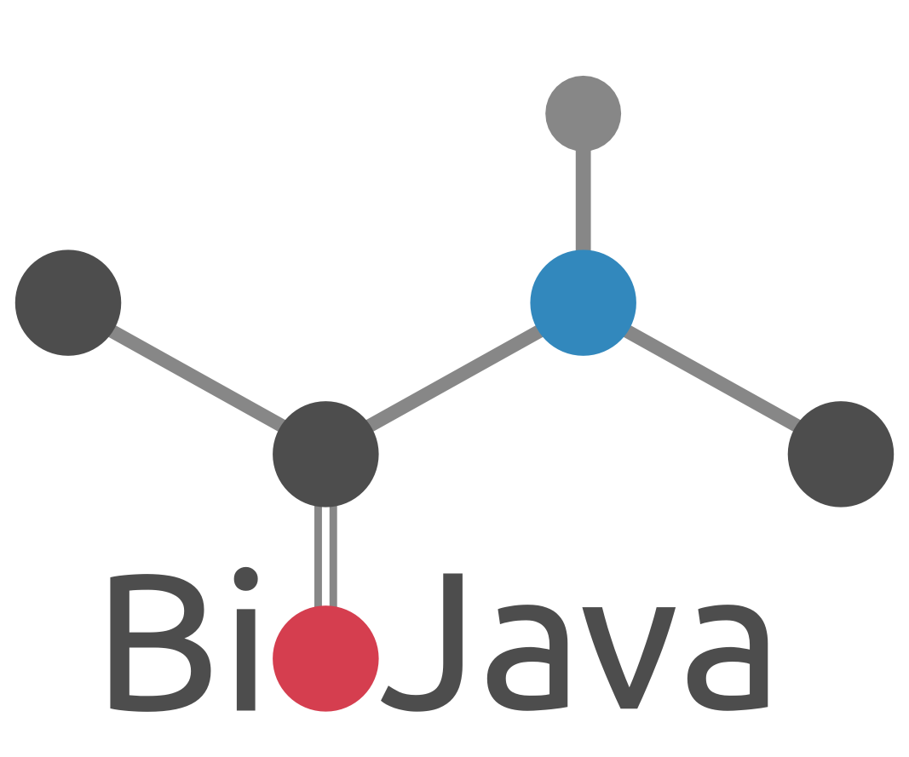

# Connected Peptide-Bond BioJava Color Logo

# Contact Info

- Author: Aleix Lafita
- Email: aleixlafita@gmail.com
- Github: github.com/lafita

# Description

The peptide bond links amino acids together to generate proteins, the working units of biology. 
Likewise, the *BioJava Project* links together a large community of programmers to generate software for bioinformatics.

The logo is designed with a flat ball and stick representation of the peptide bond as positive figure. 
Balls are colored according to their Atom type: red oxygen, blue nitrogen, black carbon and grey hydrogen.
The carboxil oxygen ball creates the O letter in the **BioJava** word, written at the bottom part of the logo with the Ubuntu font type.
