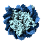

Nucleosome Logo
===============

Contact Info
------------

**Author:** Spencer Bliven
**Email:** spencer.bliven@gmail.com
**Github:** https://github.com/sbliven

Description
-----------

This logo highlights the nucleosome complex (PDB: 3C1B). This complex incorporates both DNA and protein components, reflecting the applicability of BioJava to both sequence and structural problems.

Technical Details
-----------------

The logo uses the following blue palette, which could be incorporated elsewhere on the website.

#a6e2ecff
#0e345fff
#4983c4ff

The free font Arimo is used for text.

